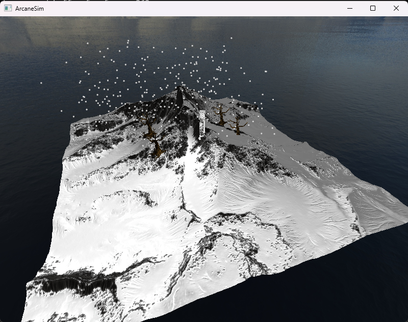
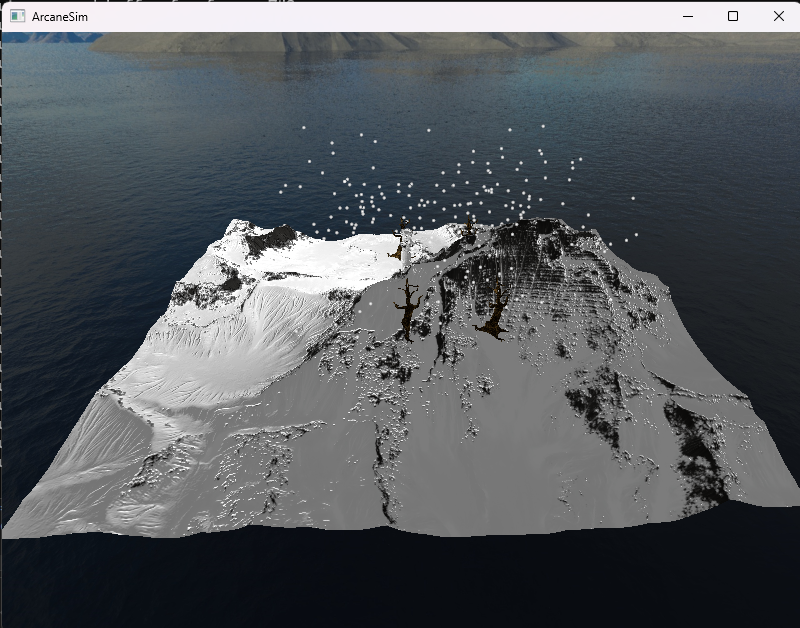

# ArcaneSim

A Vulkan-based 3D rendering engine featuring snow terrain, a medieval tower, instanced dead tree, and a GPU particle system inside a skybox.

## Demo

https://youtu.be/51O6j-2cLjQ

## Overview

ArcaneSim is a portfolio project I built to demonstrate 3D rendering using the Vulkan graphics API. The project showcases a snowy mountain landscape with a medieval stone tower, instanced dead trees, and a GPU-based falling snow particle system, showcasing techniques like normal mapping, Phong lighting, skybox rendering, instanced rendering, and compute shader.

## Features

- **Vulkan Rendering Pipeline** - Modern graphics API implementation from scratch
- **Phong Lighting Model** - Ambient, diffuse, and specular lighting with configurable light sources
- **Normal Mapping** - TBN matrix calculation for enhanced surface detail
- **Skybox Rendering** - 360-degree cubemap environment with depth optimisation
- **Interactive Camera** - First-person controls with WASDQE movement and mouse look
- **Push Constants** - Efficient per-object transforms for rendering multiple models
- **Multi-Model Scene** - Snow mountain terrain, medieval tower, and dead tree with individual textures
- **Instanced Rendering** - Multiple dead trees rendered in a single draw call, each with unique transform data
- **GPU Particle Snow System** - Falling snow particles with randomised speed and alpha blending

## Technical Stack

- **Graphics API:** Vulkan API 1.0
- **Languages:** C++
- **Libraries:** GLFW, GLM, stb_image, tinyobjloader
- **Shaders:** GLSL (compiled to SPIR-V)

## Screenshots

## Controls

- **Movements:** WASD
- **Mouse:** Camera Rotation
- **Up and down movements:** QE

## Building

- Install Vulkan SDK
- Clone the repository
- Compile the shaders (run compile.bat in shaders folder)
- Visual Studio Build and run

## Credits

### 3D Models
- **Great Mountain** by Gesy - [Sketchfab](https://sketchfab.com/3d-models/great-mountain-dd826f1f05c544ccb671949ebca59721)
- **Kickelhahn Tower** by 3DHaupt - [Sketchfab](https://sketchfab.com/3d-models/kickelhahn-tower-weyeuTkdMADFF53EZq4U38mmx3P)
- **Low Poly: Dead Tree** by ClintonAbbott.Art - [Sketchfab](https://sketchfab.com/3d-models/low-poly-dead-tree-addc2aef9e534a93a8798320fea440ef)

### Textures
- **Skybox textures** from LearnOpenGL by Joey de Vries - [learnopengl.com](https://learnopengl.com/Advanced-OpenGL/Cubemaps)

## Why I made this

I'm applying for junior/graduate graphics programming positions and wanted to build something that shows I can work with graphics APIs like Vulkan. This project demonstrates my understanding in rendering pipelines, shader programming, and 3D math.

Built in February 2026, updated June 2026